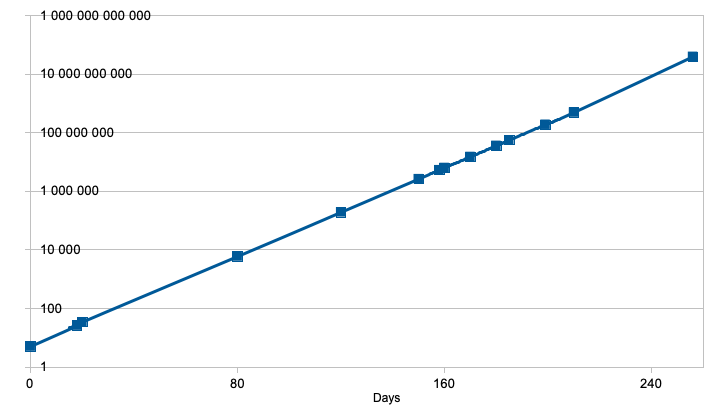
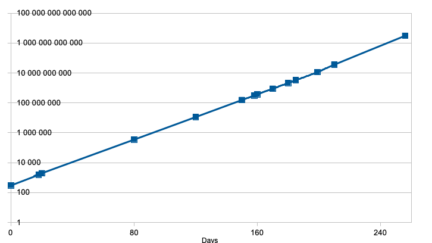

# Analysis

The growing of the school of fishs could be somewhat exponential, but for now **we do not know** it's growth rate yet.

# Design

First - and straight - idea was to simulate the Lanternfish's life and school of (linked) fishs.

```ada
type Lanternfish_Ptr is access all Lanternfish;

type Lanternfish is record
    Timer   : Life_Timer      := BabyFish;
    Sibling : Lanternfish_Ptr := null;
end record;
```

A new baby fish can be done easily throught the use of dynamic allocation when one comes at it's life-timer of `0`.

```ada
  procedure New_Fish (Timer : Life_Timer) is
  (...)
    begin
  (...)
        Last_fish := new Lanternfish;
  (...)
        Previous_Last_Fish.Sibling := Last_fish;
  (...)

    end New_Fish;
```

## First results

### Population

Running the simulation for 18 or 80 days of a school of Lanternfish was cool 😎 ... in the begining 

Going further became a nightmare 😫 ... of over-population 🐟🐟🐟🐟🐟🐟🐟🐟🐟🐟🐟!

| Day | 🐟 Population | 🐟 Population |
| --:| --:| --:|
| 0 | 5 | 300|
| 18| 26| 1 563|
| 20| 34| 1 959|
| 80| 5_934| 350_605|
| 120| 191 336| 11 301 761|
| 150| 2 621 894| 154 900 658|
| 160| 6 311 710| 372 489 150|
| 170| 14 979 958| 883 463 328|
| 180| 35 890 123| 2 120 130 781|
| 185| 55 653 352| 3 285 743 983|
| 210| 490 587 171|  *Out of memory* |
| 256| *Out of memory* |  *Out of memory* |

Some charting shows clearly that growth is a 10 exponential here, with a factor depending on the initial data (5🐟 ou 300🐟) : respectively 24 or 20.





One can then extrapolate what the population would be after 256 days.

| Day | 5 Initial Population | 300 Initial Population |
| --:| --:| --:|
| 256| 39_300_000_000 | 3_070_000_000_000 |
| 256| 39 Giga | 3 Tera |

### Execution time
Execution time (sec) ... on a [Ryzen 3900](https://www.amd.com/fr/products/cpu/amd-ryzen-9-pro-3900) @ 4,3 GHz equiped with 64 GB of RAM.

| Day | 5 🐟  at init. | 300 🐟 at init. |
| --:| --:| --:|
| 18 | 0,005 | 0,01 |
| 20 | 0,005 | 0,01 |
| 80 | 0,005 | 0,01 |
| 120 | 0,015 | 0,32 |
| 150 | 0,15 | 4,72 |
| 158 | 0,309 | 9,24 |
| 160 | 0,195 | 11,08 |
| 170 | 0,447 | 26,59 |
| 180 | 2,202 | 63,76 |
| 185 | 1,796 | 105,76 |
| 199 | 11,246 | Out of memory 162 GB |
| 210 | 29,25 |  Out of memory |
| 256 | Out of memory | Out of memory 284 GB |

# Clearly, have to find another simulation algorithm 🧞‍♂️

## 💡 New solution pattern 💡

Based on the **cyclic vertical schema** observed for each existing fish (`6` down to `0`), and (`8` down to `0`) for a new fish, one could consider the initial shool of fish (5🐟 or 300🐟 in the data files provided) as an inital *frame* i.e array, which will be continued (repaced ?) with another new *frame*.
Counting the population will be a matter of counting the frames and columns containing some fish.

Values of the dimensions of the *frame* are for now hard-coded 🖐🏼.

```ada
Nb_Days_of_Generations : Positive := 18;
Initial_Population     : Positive := 5;
```
which could be replaced by
```ada
Nb_Days_of_Generations : Positive := 256;
Initial_Population     : Positive := 300;
```

```ada
-- Specific Frame algorithm
-- ------------------------

type Generations_array is array (0 .. Nb_Days_of_Generations, 1 .. Initial_Population) of Lanternfish;
```
